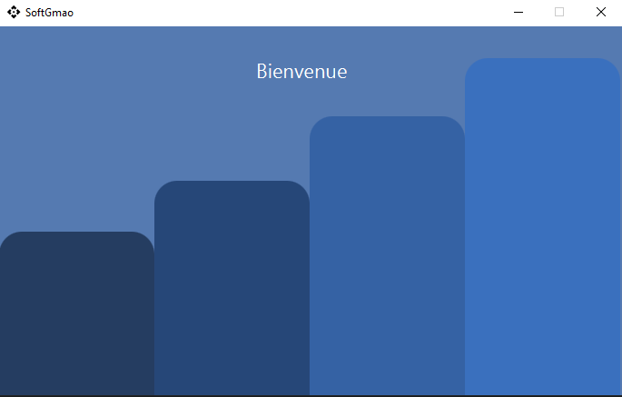
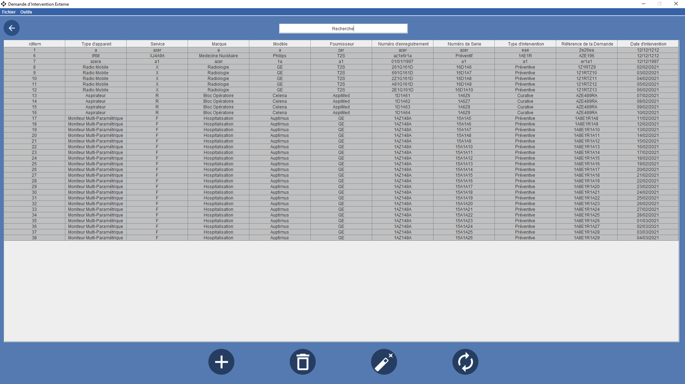
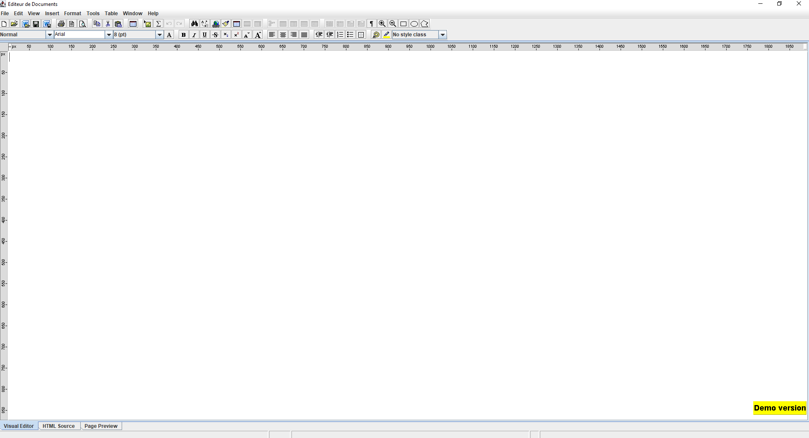
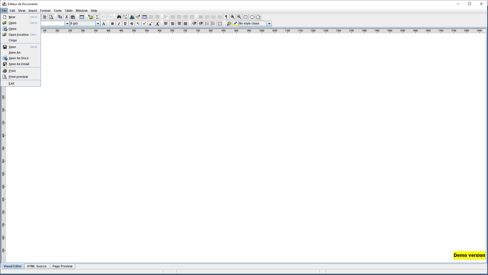
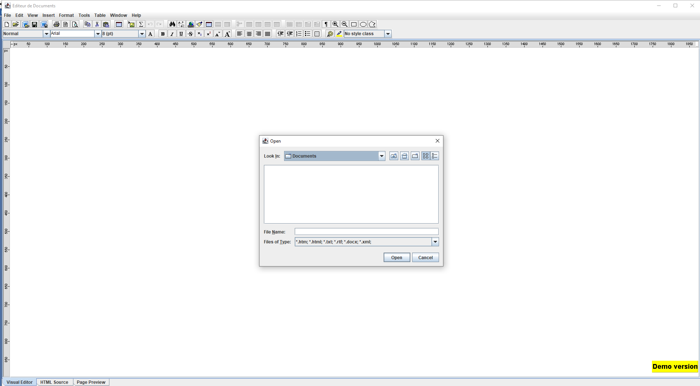
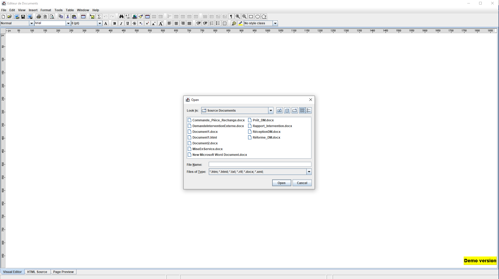
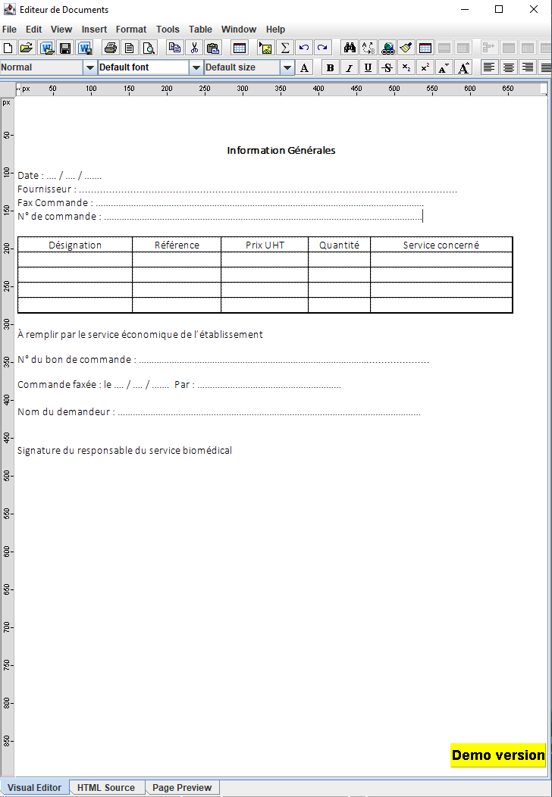

 Before compiling 

 
********************************************************************************************************************

Please make sure to have mysql server installed and running, as well as the database tables compiled in your mysql server in order to get 
the full experience !!

In case you face a javafx error "JavaFX runtime component are missing, and are required to run this application", and if you use eclipse : 
 -  Go to Run configurations
 -  Arguments
 -  And in VM arguments please insert : --module-path "javafx lib PATH that you can find in the 'jars' file" --add-modules javafx.controls,javafx.fxml

 
********************************************************************************************************************

  

 
********************************************************************************************************************

This project is a basic demonstration of CMMS (Computer Maintenance Management System) that can be used 
in a Hospital environnement.
It was made with mysql as well as apache poi and "sferyx" api for .docx files (insertion/addition/modification).

Note that the usability of the sferyx api is limited to a usability that ends after a month (Test version).

Enjoy the program.

 
********************************************************************************************************************

  
  

 
********************************************************************************************************************

  

 
********************************************************************************************************************

  

 
********************************************************************************************************************

  

 
********************************************************************************************************************

  

 
********************************************************************************************************************

  

 
********************************************************************************************************************

  

 
********************************************************************************************************************

  

